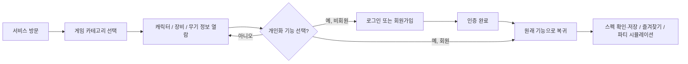

# Buildex 기본 설계서

> 버전: 0.2 · 작성일: 2026-07-16 · 상태: 기반 구축 완료, MVP 구현 진행 중

## 1. 서비스 개요

Buildex는 게임별 캐릭터와 장비·무기 정보를 탐색하고, 로그인한 사용자가 자신의 캐릭터 스펙을 저장·관리하며 파티 조합을 검토할 수 있는 웹 애플리케이션이다.

서비스의 기본 정보 탐색은 비회원에게 개방한다. 다만 개인 데이터가 생기거나 계산 결과를 저장하는 기능은 회원으로 한정한다. 이를 통해 처음 방문한 사용자가 가입 전에 정보 품질을 확인할 수 있게 하고, 개인화가 필요한 시점에 자연스럽게 가입하도록 유도한다.

## 2. 목표와 범위

### 2.1 MVP 목표

- 게임 카테고리에서 지원 게임을 선택한다.
- 캐릭터, 장비, 무기 정보를 누구나 조회한다.
- 회원은 캐릭터 스펙을 확인하고 저장하며, 즐겨찾기와 파티 조합 시뮬레이션을 이용한다.
- 로그인 및 회원가입은 자체 인증으로 시작하되, 외부 인증 제공자 추가를 수용하는 구조로 설계한다.

### 2.2 MVP 제외 범위

- 사용자 간 파티 모집·채팅·친구 관계
- 커뮤니티 게시판 및 사용자 제작 공략
- 실시간 게임 계정 연동 및 자동 스펙 동기화
- 결제, 구독, 광고 기능

## 3. 사용자와 권한

| 사용자 상태 | 가능한 기능 | 제한 기능 |
| --- | --- | --- |
| 비회원 | 게임 선택, 캐릭터·장비·무기 목록 및 상세 정보 열람 | 스펙 확인/저장, 즐겨찾기, 파티 조합 시뮬레이션 |
| 회원 | 비회원 기능 전체 + 개인화 기능 | 없음 (관리 기능 제외) |
| 관리자 | 콘텐츠 데이터 관리 및 운영 기능 | 별도 운영 정책 수립 필요 |

### 3.1 로그인 유도 원칙

로그인이 필요한 기능을 선택한 비회원에게 현재 보던 게임·캐릭터 맥락을 유지한 채 로그인 또는 회원가입 화면을 제공한다. 인증 완료 후에는 원래 기능으로 돌아가도록 한다. 단순 정보 탐색 화면에는 가입을 강제하지 않는다.

## 4. 핵심 사용자 흐름

## 5. 기능 설계 원칙

### 공개 콘텐츠

- 게임 카테고리를 최상위 탐색 기준으로 둔다.
- 캐릭터, 장비, 무기 상세 페이지는 직접 링크로도 접근 가능해야 한다.
- 콘텐츠 데이터에는 게임별 버전 또는 기준일을 표시해 정보의 적용 시점을 알린다.

### 개인화 콘텐츠

- 스펙 저장, 즐겨찾기, 시뮬레이션 결과는 사용자 계정에 귀속한다.
- 저장 전에는 계산 결과를 미리 볼 수 있어도, 영구 보관은 로그인 사용자만 할 수 있다.
- 회원 탈퇴·개인정보 처리 기준은 별도 정책 문서에서 정한다.

### 인증 확장성

- 회원의 서비스 식별자와 로그인 수단을 분리한다.
- 이메일/비밀번호 가입을 첫 인증 수단으로 두되, Google·Kakao·Naver 등 외부 제공자를 이후 연결할 수 있게 한다.
- 동일 이메일로 여러 로그인 수단이 들어오는 경우의 계정 연결 정책은 구현 전에 확정한다.

## 6. 화면 구성 초안

| 화면 | 목적 | 비회원 | 회원 |
| --- | --- | --- | --- |
| 홈 / 게임 선택 | 지원 게임으로 진입 | 가능 | 가능 |
| 캐릭터 목록·상세 | 캐릭터 기본 정보 열람 | 가능 | 가능 |
| 장비·무기 목록·상세 | 장비와 무기 정보 열람 | 가능 | 가능 |
| 로그인 | 기존 계정 인증 | 가능 | 가능 |
| 회원가입 | 신규 계정 생성 | 가능 | 가능 |
| 내 캐릭터 스펙 | 스펙 조회·저장·관리 | 로그인 유도 | 가능 |
| 즐겨찾기 | 저장한 캐릭터 빠른 접근 | 로그인 유도 | 가능 |
| 파티 시뮬레이터 | 조합 설정과 결과 확인 | 로그인 유도 | 가능 |

## 7. 결정이 필요한 항목

- 첫 번째로 지원할 게임과 해당 게임 데이터의 출처·갱신 방식
- 스펙 입력 방식: 사용자의 직접 입력, 게임 API 연동, 또는 둘 다
- 파티 조합의 인원 수, 역할 규칙, 계산 지표
- 외부 인증 제공자 우선순위와 계정 연결·해제 정책
- 비회원에게 계산 결과의 미리보기까지 허용할지 여부

## 8. 구현 기준선

2026-07-16 기준으로 Next.js 기반, 이메일/비밀번호 인증 흐름, PostgreSQL·Drizzle 스키마, Docker 개발 환경, Zod 검증 및 Vitest 테스트 기반을 구현했다.

- 홈, 로그인, 회원가입 화면은 구현됐지만 공개 콘텐츠 탐색과 개인 빌드 화면은 아직 구현하지 않았다.
- 이메일/비밀번호 로그인은 Auth.js Credentials로 구성했다. 로그아웃 UI·보호 경로·로그인 후 원래 경로 복귀는 다음 인증 보강 작업에서 구현한다.
- 첫 지원 게임은 명조로 확정했으나, 캐릭터·무기·에코 실제 데이터와 스탯 계산식은 아직 코드에 넣지 않았다.
- 이후 기능 설계와 구현은 `docs/requirements.md`의 구현 현황을 함께 갱신한다.
