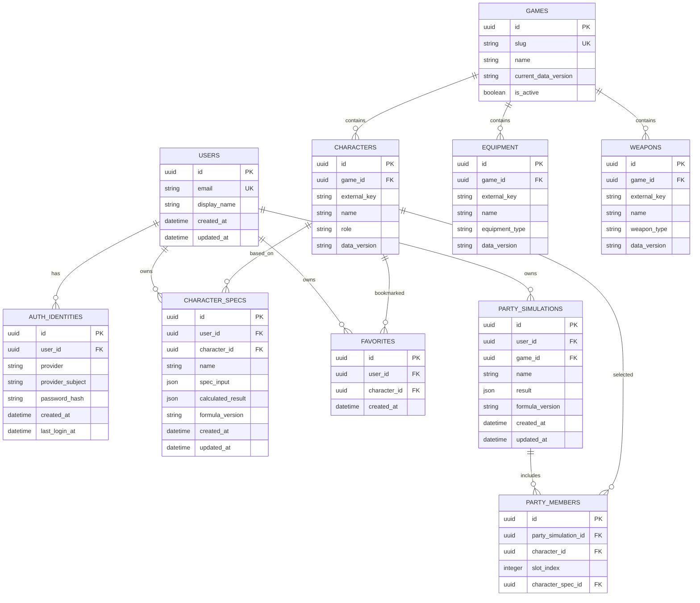

# Buildex 데이터 모델 초안

> 버전: 0.1 · 작성일: 2026-07-16 · 구현 전 검토용

## 1. 모델링 원칙

- `users`는 서비스의 주체이며, 로그인 수단과 분리한다.
- `auth_identities`는 이메일/비밀번호 및 향후 OAuth 제공자를 한 모델로 수용한다.
- 게임 콘텐츠는 게임 단위로 분리하고, 캐릭터·장비·무기는 공개 데이터로 관리한다.
- 개인화 데이터는 반드시 `user_id`를 가져 사용자별 접근 제어의 기준이 된다.
- 스펙·시뮬레이션 결과에는 적용한 데이터와 계산식 버전을 기록할 수 있어야 한다.

## 2. ERD

## 3. 핵심 테이블 정의

| 테이블 | 용도 | 주요 제약 |
| --- | --- | --- |
| `users` | 서비스 사용자 | `email` 고유, 탈퇴/상태 관리 컬럼은 정책 확정 후 추가 |
| `auth_identities` | 로그인 수단 | `(provider, provider_subject)` 고유; password provider만 `password_hash` 사용 |
| `games` | 지원 게임 | `slug` 고유, 데이터 버전 관리 |
| `characters` | 공개 캐릭터 정보 | 게임 내 외부 식별자와 조합해 고유 처리 |
| `equipment`, `weapons` | 공개 아이템 정보 | 게임별 분류와 데이터 버전 보유 |
| `character_specs` | 회원 저장 스펙 | `user_id`로 소유권 검증, 입력값과 결과 스냅샷 저장 |
| `favorites` | 회원 즐겨찾기 | `(user_id, character_id)` 고유 |
| `party_simulations` | 회원 파티 계산 | 사용자·게임·계산식 버전 보유 |
| `party_members` | 파티 구성원 | 시뮬레이션 내 `slot_index` 고유 |

## 4. 인증 제공자 설계

`auth_identities.provider` 예시는 `password`, `google`, `kakao`, `naver`다. 자체 가입은 `provider=password`, `provider_subject=정규화된 이메일`로 기록하고 비밀번호 해시는 `password_hash`에만 저장한다. OAuth 제공자는 제공자가 반환한 안정적 사용자 식별자를 `provider_subject`에 저장한다.

하나의 `users` 레코드에 복수의 인증 수단을 연결할 수 있다. 단, 이메일 일치만으로 외부 계정을 자동 연결하지 않는다. 자동 연결은 계정 탈취 위험이 있으므로, 로그인된 사용자의 명시적 연결 또는 검증된 계정 복구 절차를 통해서만 허용한다.

## 5. 구현 시 확인할 사항

- 아이템의 세부 옵션을 정규화할지 JSON 속성으로 저장할지는 첫 지원 게임의 데이터 복잡도를 확인한 뒤 결정한다.
- 캐릭터 스펙 결과를 재현할 수 있도록 `data_version`, `formula_version`을 결과 스냅샷에 포함한다.
- 즐겨찾기는 캐릭터만 대상으로 시작한다. 장비·무기 즐겨찾기는 필요 시 별도 테이블 또는 대상 타입 확장으로 추가한다.
- 파티 조합 규칙(최대 인원, 역할 중복 등)은 게임별 설정 테이블로 분리할 여지가 있다.
