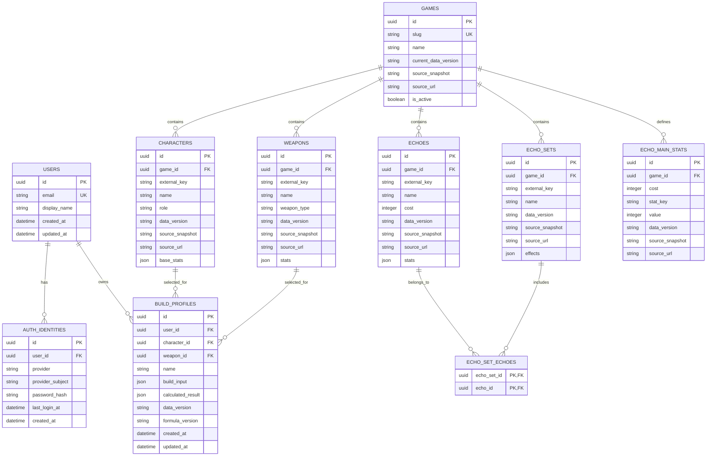

# Buildex 데이터 모델

> 버전: 0.3 · 작성일: 2026-07-16 · 상태: 명조 3.5 시드 반영

## 1. 모델링 원칙

- `users`와 `auth_identities`를 분리해 자체 로그인과 후속 OAuth를 함께 수용한다.
- 공개 게임 데이터는 게임 단위로 묶고, 외부 식별자·게임 버전·검수 스냅샷 날짜·출처를 함께 기록한다.
- 에코 세트와 에코는 다대다로 연결하고, 코스트별 주옵은 별도 기준 데이터로 관리한다.
- 사용자 빌드는 입력값과 계산 결과를 JSON 스냅샷으로 저장하며, 게임 데이터·계산식 버전을 명시한다.
- 아직 구현하지 않은 즐겨찾기·파티 시뮬레이션은 스키마에 섣불리 넣지 않는다. 요구사항이 확정되면 별도 마이그레이션으로 추가한다. 미래의 나에게 애매한 빈 테이블을 물려주지 않는 편이 낫다.

## 2. 구현된 ERD

## 3. 구현된 테이블과 제약

| 테이블 | 용도 | 주요 제약 |
| --- | --- | --- |
| `users` | 서비스 사용자 | `email` 고유 |
| `auth_identities` | 로그인 수단 | `(provider, provider_subject)` 고유, 비밀번호는 해시만 저장 |
| `games` | 지원 게임 | `slug` 고유, 현재 데이터 버전 보유 |
| `characters` | 공개 캐릭터 데이터 | `(game_id, external_key)` 고유 |
| `weapons` | 공개 무기 데이터 | `(game_id, external_key)` 고유 |
| `echoes` | 공개 에코 데이터 | `(game_id, external_key)` 고유, 코스트와 기본 수치 저장 |
| `echo_sets` | 에코 세트 효과 | `(game_id, external_key)` 고유, 2세트·5세트 효과와 출처 스냅샷 저장 |
| `echo_set_echoes` | 에코 세트 구성 | `(echo_set_id, echo_id)` 복합 기본 키 |
| `echo_main_stats` | 코스트별 주옵 기준 | `(game_id, cost, stat_key)` 고유 |
| `build_profiles` | 사용자 빌드 프리셋 | 사용자 소유, 캐릭터·무기 참조, 입력·결과·버전 스냅샷 저장 |

## 4. 기획 대비 변경점

- 초기 초안의 일반 `equipment`는 명조 MVP의 실제 도메인에 맞춰 `echoes`로 구체화했다.
- 초기 초안의 `character_specs`는 에코 5개 묶음을 이름으로 저장한다는 요구사항에 맞춰 `build_profiles`로 변경했다.
- `favorites`, `party_simulations`, `party_members`는 아직 미구현이다. 해당 기능 구현 시 소유권, 슬롯 중복, 게임별 파티 규칙을 확정한 뒤 마이그레이션으로 추가한다.
- `build_profiles.calculated_result`는 계산식 변경 후에도 과거 결과를 재현·비교하기 위한 스냅샷이다.

## 5. 인증 제공자 설계

`auth_identities.provider`는 현재 `password`를 사용한다. `provider_subject`에는 정규화한 이메일을 저장하고, `password_hash`에는 bcrypt 해시만 저장한다. 이후 `google`, `kakao`, `naver` 등을 추가할 때에는 제공자가 발급하는 안정적 식별자를 `provider_subject`로 사용한다.

외부 계정은 이메일이 같다는 이유만으로 자동 연결하지 않는다. 로그인된 사용자의 명시적 연결 또는 검증된 계정 복구 절차를 통해서만 연결한다.
