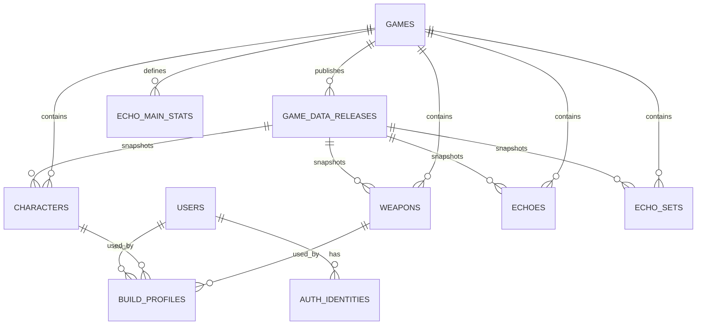

# Buildex ERD

## 핵심 테이블

| 테이블 | 역할 |
| --- | --- |
| `users` | 사용자 계정과 역할(`user` / `admin`) |
| `auth_identities` | 인증 제공자 식별자와 비밀번호 해시 |
| `games` | 게임 메타데이터와 현재 공개 릴리스 |
| `game_data_releases` | 패치 단위 데이터 스냅샷과 발행 상태 |
| `characters` | 릴리스별 캐릭터 기본 스탯과 무기 타입 |
| `weapons` | 무기 스탯과 무기 타입 |
| `echoes`, `echo_sets`, `echo_main_stats` | 에코와 세트, 비용별 주옵션 데이터 |
| `build_profiles` | 사용자별 빌드 입력값과 서버 계산 결과 |

`build_profiles`는 사용자·캐릭터·무기와 계산에 사용한 `data_release_id`를 함께 보관한다. 원본 입력(`build_input`), 계산 결과(`calculated_result`), 데이터 릴리스와 계산식 버전을 저장해 과거 결과를 재현한다.
