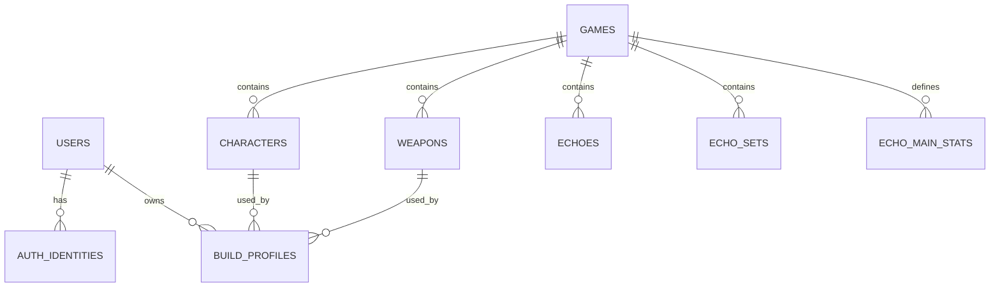

# Buildex ERD

## 핵심 테이블

| 테이블 | 역할 |
| --- | --- |
| `users` | 사용자 계정 |
| `auth_identities` | 인증 제공자 식별자와 비밀번호 해시 |
| `games` | 게임 메타데이터와 데이터 버전 |
| `characters` | 캐릭터 기본 스탯과 무기 타입 |
| `weapons` | 무기 스탯과 무기 타입 |
| `echoes`, `echo_sets`, `echo_main_stats` | 에코와 세트, 비용별 주옵션 데이터 |
| `build_profiles` | 사용자별 빌드 입력값과 서버 계산 결과 |

`build_profiles`는 사용자·캐릭터·무기를 외래 키로 보관하며, 재현 가능한 결과를 위해 원본 입력(`build_input`), 계산 결과(`calculated_result`), 데이터 버전과 계산식 버전을 함께 저장한다.
